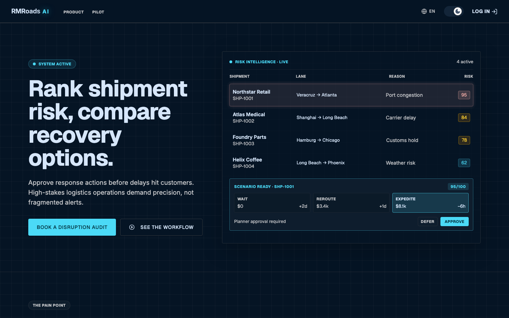

# RMRoads AI

> Open-source supply-chain disruption response workbench. Rank shipment exception risk, compare recovery options, and approve the response before delays reach the customer.



[](LICENSE)
[](https://wasp.sh)
[](https://opensaas.sh)

RMRoads AI is a self-hosted decision-support tool for shipment planners. It surfaces exposed shipments, ranks them by business impact, and presents recovery scenarios (reroute, expedite, split, notify, wait) for human approval — with the audit trail captured automatically.

The project is published as a free, open-source codebase under the MIT license. There is no hosted version, no paid tier, no telemetry. Clone it, run it, change it.

## Features

- **Shipment exception queue** with deterministic, explainable risk scoring
- **Manual disruption signals** (port congestion, carrier delays, weather, customs) you can add and toggle in seconds
- **Scenario comparison** (cost vs ETA vs customer risk vs complexity) per exception
- **Approve / defer / reject decisions** with audit history and outcome tracking
- **Critical alert emails** and a **weekly pilot summary** cron job
- **Multi-tenant workspaces** — every Prisma write is org-scoped, with invitation flows for teammates
- **i18n** in English / German / French / Spanish (with the infrastructure in place to add more)
- **Dark mode default** with light-mode parity
- **CSV import** as the only ingest path — no integrations required to try it
- **OpenSaaS admin panel** for pilot leads, tenant health, and recommendation log review

## Screenshots

| Landing page | |
|---|---|
|  | |

## Tech stack

- [**Wasp**](https://wasp.sh) — TypeScript fullstack DSL (React + Node + Prisma)
- [**OpenSaaS**](https://opensaas.sh) — SaaS-shaped boilerplate (auth, admin, payments scaffolding)
- **React 18** + **Tailwind CSS** + **shadcn/ui** + **Radix UI**
- **PostgreSQL** via Prisma
- **i18next** for localization (en/de/fr/es)
- **anime.js** for landing motion
- **Playwright** for E2E
- **Mailpit** for local SMTP catching during development

## Quick start

### Prerequisites

- [Wasp CLI](https://wasp.sh/docs/quick-start) (0.x — pre-1.0, install via `curl -sSL https://get.wasp.sh/installer.sh | sh`)
- Node.js 18+
- Docker (used by Wasp to run the dev PostgreSQL)
- (Optional) [Mailpit](https://mailpit.axllent.org) for local email — `brew install mailpit` on macOS

### Clone and run

```sh
git clone https://github.com/<your-fork>/rmroads-ai.git
cd rmroads-ai/app
cp .env.server.example .env.server
wasp start db          # spins up the dev Postgres in Docker
wasp db migrate-dev    # in a second terminal
wasp start             # runs the app on http://localhost:3000
```

Open `http://localhost:3000` for the landing page, or sign up and visit `http://localhost:3000/rmroads` for the workbench.

### Seed demo data

On the empty workspace, click **Seed demo data** in the dashboard sidebar — it creates a few shipments, signals, and exceptions so you can exercise the full flow without hand-rolling CSV.

## Configuration

All config lives in `app/.env.server`. The committed `.env.server.example` lists every variable. The ones you'll touch first:

| Variable | What it controls |
|---|---|
| `DATABASE_URL` | Wasp manages this automatically with `wasp start db`. Override only if you point at a non-Wasp Postgres. |
| `SMTP_HOST` / `SMTP_PORT` / `SMTP_USERNAME` / `SMTP_PASSWORD` | Email delivery. Defaults work for Mailpit on `localhost:1025`. Swap for SendGrid/SES/Postmark/Resend in self-hosted setups. |
| `ADMIN_EMAILS` | Comma-separated. Any user who signs up with one of these becomes an admin on first login. |
| `WASP_WEB_CLIENT_URL` / `WASP_SERVER_URL` | Public URLs for email links. Set these when deploying. |
| `RMROADS_LLM_RECOMMENDATIONS_MODE` | `off` (default — deterministic recommendations), `dummy` (exercise the LLM code path with a locally-computed plausible response, zero tokens), or `openai` (scaffolded but not yet wired — reserved for the slice where prompt logging + provider config land). Anything else falls back to `off`, so forks never accidentally hit a provider. |

### Email in development

The app ships with `emailSender.provider = SMTP` pointing at Mailpit. Start Mailpit before `wasp start` so the invitation, alert, and weekly-summary emails have somewhere to go:

```sh
mailpit            # SMTP on :1025, web UI on http://localhost:8025
```

## Payments (optional)

The repo ships the OpenSaaS payment scaffolding intact — **Stripe**, **Lemon Squeezy**, and **Polar** processors, plus `/pricing` and `/checkout` routes and a `/payments-webhook` endpoint. It is **disabled by default** so RMRoads AI stays free to self-host without surprise dependencies.

If you want to monetize your fork, see [`app/src/payment/README.md`](app/src/payment/README.md) for the full opt-in checklist (pick a provider, set env vars, wire your webhook, drop the providers you don't use).

## Project layout

```text
rmroads-ai/
├── app/                 # Wasp app (primary product surface)
│   ├── main.wasp        # Wasp DSL: routes, ops, auth, email, jobs
│   ├── schema.prisma    # Prisma models
│   ├── src/
│   │   ├── rmroads/     # Domain logic, operations, dashboard UI
│   │   ├── legal/       # Privacy / Terms / Cookies stub pages
│   │   ├── i18n/        # i18next setup + en/de/fr/es locales
│   │   ├── auth/        # Login / Signup / password-reset UI
│   │   ├── admin/       # OpenSaaS admin dashboards
│   │   └── client/      # Shared layout, navbar, theming, UI primitives
│   └── migrations/      # Prisma migrations managed by Wasp
├── blog/                # OpenSaaS blog (Astro + Starlight) — optional
├── e2e-tests/           # Playwright E2E suite + screenshot capture utility
└── screenshots/         # README assets
```

## Development

### Type-check

```sh
cd app
npm exec tsc -- --noEmit
```

### Database

```sh
wasp db migrate-dev      # create + apply a new migration
wasp db studio           # open Prisma Studio
```

### E2E tests

```sh
cd e2e-tests
npm install              # first time only
npx playwright install   # browsers
npx playwright test
```

### Refresh the landing screenshot

With `wasp start` running on `:3000`:

```sh
cd e2e-tests
npx playwright test take-landing-screenshot.spec.ts
```

The new image lands at `screenshots/landing.png`.

## i18n

The app ships in **English, German, French, Spanish**. The language switcher lives in the top-right nav. To add a locale:

1. Add an entry to `SUPPORTED_LANGUAGES` in [app/src/i18n/index.ts](app/src/i18n/index.ts).
2. Create `app/src/i18n/locales/<code>.ts` and mirror the shape of `en.ts`.
3. Restart `wasp start` so the new module is picked up.

Translations are TypeScript modules (not JSON) because Wasp's SDK build doesn't enable `resolveJsonModule`.

## Contributing

Pull requests are welcome. A few ground rules:

- Keep new features behind small slices — see [docs/rmroads-ai-plan/](docs/rmroads-ai-plan/) for the existing plan docs (gitignored locally; included in upstream releases).
- Commit subjects ≤ 50 chars, imperative mood, Conventional Commits prefix where it fits.
- All Prisma writes must be org-scoped — RMRoads is multi-tenant by design.
- New strings need entries in all four locale files. Keep DE/FR/ES translations concise so buttons and table cells don't overflow.

If you find a bug, open an issue with reproduction steps.

## Acknowledgements

Built on top of [**OpenSaaS**](https://github.com/wasp-lang/open-saas) by the Wasp team — an MIT-licensed SaaS template that bundles auth, admin, payments scaffolding, and an Astro blog. RMRoads AI replaces the demo-app surface with a supply-chain workbench but keeps the OpenSaaS conventions for everything around it.

## License

[MIT](LICENSE). Use it, fork it, ship it. The original OpenSaaS and Wasp copyright notices are preserved in the upstream code they cover.
